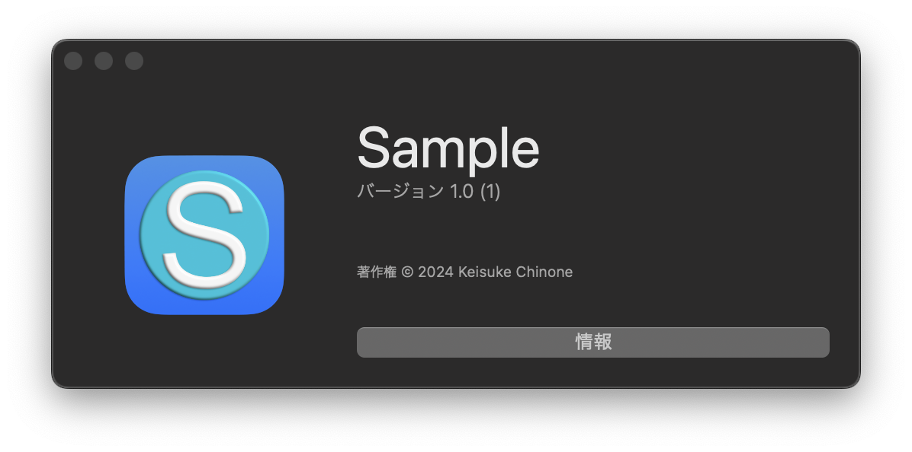
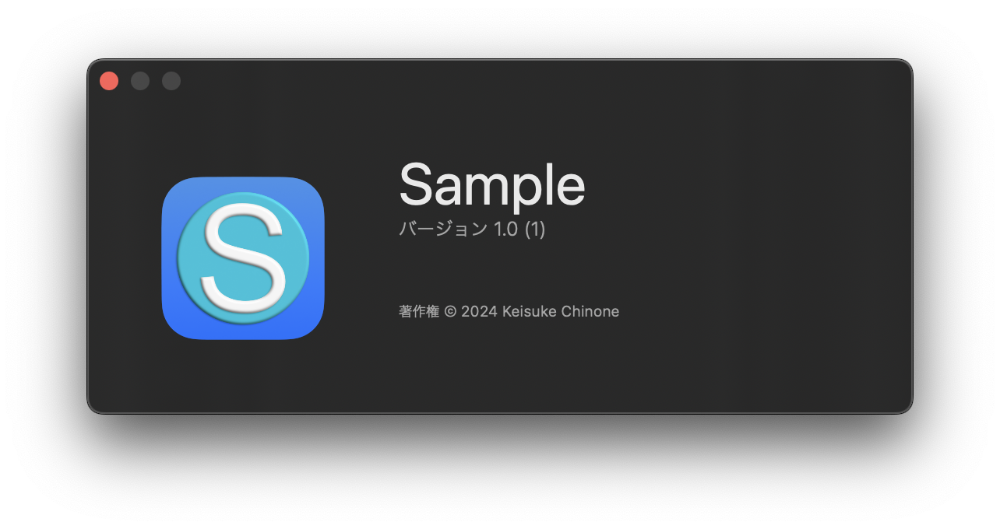

# AboutUI

SwiftUI library to implement an “about the app” page like an Xcode app.

## Description

Using this library, you can implement an “about app” page in your own app, as implemented in the Xcode app.
Since this library is made by SwiftUI, it can be implemented with a small number of lines.
You can further customize it and add buttons.

## Requirement

The following environment is required to use this library.  

<p align="center">
    
    
    <a href="https://twitter.com/IroIro1234work">
        
    </a>
</p>

## Language

Supported languages are as follows In regions with languages other than these, English should be displayed.
If you would like to add more supported languages, please edit Localizable.xcstrings and do the translation work.

- English
- Japanese

## Demo

To verify the operation of this library, we created a sample application in the library. Please refer to it.

## Usage

This framework can be easily implemented by simply adding Scenes. 


```swift
import SwiftUI
import AboutUI

@main
struct SampleApp: App {
    var body: some Scene {
        WindowGroup {
            ContentView()
        }

        AboutScene()
    }
}
```

 

```swift
import SwiftUI
import AboutUI

@main
struct SampleApp: App {
    var body: some Scene {
        WindowGroup {
            ContentView()
        }
        
        AboutScene {
            Button(action: {
                
            }) {
                Text("Info")
                .frame(maxWidth: .infinity)
            }
            .buttonStyle(.bordered)
        }
    }
}

```

 

## Swift-DocC

Swift-DocC is currently being implemented.

[Documentation](https://kc-2001ms.github.io/AboutUI/documentation/onboardingui)

## Install

Xcode is required to use this library.
However, it is currently under development and cannot be installed. We will let you know as soon as possible.  

## Contribution
See [CONTRIBUTING.md](https://github.com/KC-2001MS/AboutUI/blob/main/CONTRIBUTING.md) if you want to make a contribution.

## Licence

[AboutUI](https://github.com/KC-2001MS/AboutUI/blob/main/LICENSE)

## Supporting

If you would like to make a donation to this project, please click here. The money you give will be used to improve my programming skills and maintain the application.   
<a href="https://www.buymeacoffee.com/iroiro" target="_blank">
    
</a>  
[Pay by PayPal](https://paypal.me/iroiroWork?country.x=JP&locale.x=ja_JP)

## Author

[Keisuke Chinone](https://github.com/KC-2001MS)
